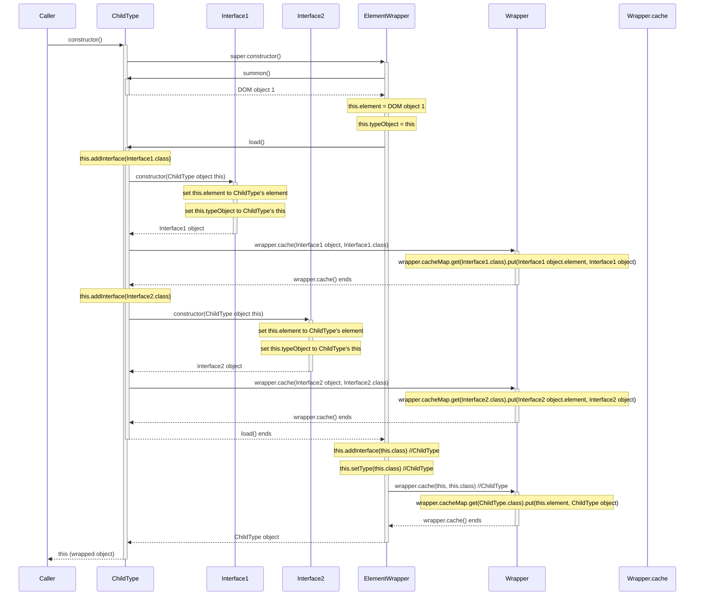
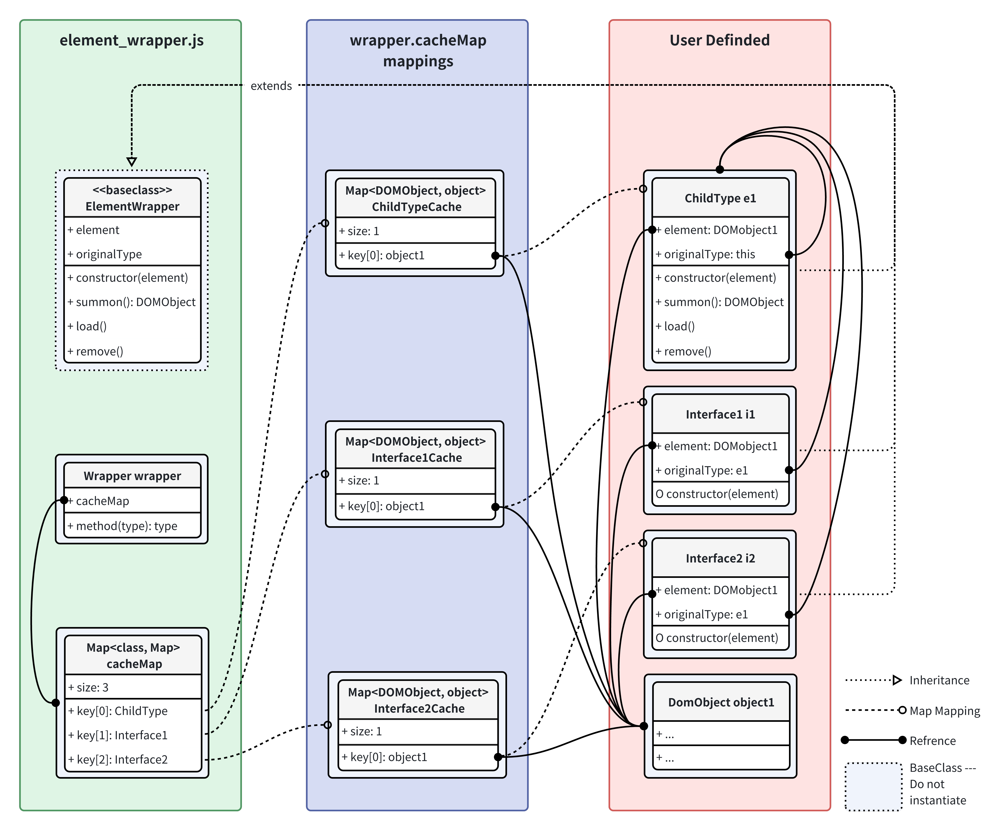

# Element Wrapper Is All You Need

## The Beginning of the Story

Why was Object-Oriented-Programming been firstly introduced in the good-old-days when everything of modern computer-programming just started? Probably it has been a topic of the start-up lessons to OOP-languages for a long time. You might have been heared about it... Yes,  it's for the GUI elements.

In most OOP languages, writting GUI elements are pretty simple and straightforward. For example, like having a requirement to implement a Pro-Max-Super-Ultra-Ti-X-Titan button, programmers just need to extend the basic button (which is provided in most GUI infrastructures that ship with languages), and adding or overriding self-assign data and methods to it. The process is pretty like attaching your own ideas around the basic, poor "vanilla" element. This fits the features of GUI elements perfectly.

However, in plain JavaScript and DOM elements, we cannot do the same thing without writting a lot of stuffs: we cannot not extends a button, so it's hard and not elegant to attach our own methods and data to it. It is especially annoying when writting a HTML5 game with tons of different types of elements, and tons of thousands of different abilities of these elements.

Could we have something to take care all of the HTML-element---JavaScript-Object one-to-one mapping, and make it easy to apply our own code like what we usually do in most other GUI frameworks? Here is what I come up with to answer this question.

Admittedly, it is clear that this work had been done by most established frameworks of the frontend, like React and VUE. But as this is designed and implemented for a pure plain JavaScript assignment, and I really make it for a interest, there should be some value in it, --- at least to some extent for myself :D.

## How to Write Your Own Types and Interfaces

Suppose that there is a Element type which extends `ElementWrapper` class (being refered to as "Child Type"), and it overrides the following methods:

* `constructor(element, ...)`, and calls `super(element)` for the first time;
* `summon()`, which just makes a HTML DOM object and returns it;
* `load()`, which assign interfaces(components), and other info that should get from the Child Type's constructor;

* `remove()`, which do all the stuff that cleans up the state with the action of removing this element, and do not need to explicitely remove `this.element` from DOM (wrapper will do it automatically for you)

The code of the Child Type will look like this:

```javascript
import { ElementWrapper, wrapper } from "path/to/element_wrapper.js"

class ChildType extends ElementWrapper {
    // Override
    constructor(element) {
        super(element);
        // more code, that can use $this
    }

    // Override
    summon() {
        let element = document.createElement('???')
        // create and set styles and etc to $element
        return element;
    }

    // Override
    load() {
        this.addInterface(Interface.class);
    }

    // Override
    remove() {
        // clean state associating with the remove of this element
    }

    // Other self-assigned methods, like moveRight(pixels) etc.
}
```

And as speaks about the `Interface`, we can simply write a code that only overrides the `constructor(element)` method, in order to call `super()`, which is the super class's constructor:

```javascript
import { ElementWrapper, wrapper } from "path/to/element_wrapper.js"

class Interface extends ElementWrapper {
    // Override
    constructor(element) {
        super(element);
        // more code, that can use $this
    }

    // No summon(), because interface do not have a DOM element

    // Not have to load(), unless you need to assign state
    load() {
        this.addInterface(OtherInterface.class);
    }

    // Not necessary to override remove()

    // Other self-assigned methods, like update() etc.
}
```

The design is that, a type is to wrap a HTML element, and hence, after wrote the Element Type, you will no longer have to make dom actions to interact with DOM actions. The element's class can also holds data that forms the element's state, which is pretty useful when implementing entities and gui overlays and so on. All you need is managing the elements through it designed methods (Like wrapping lots of additional data and method around the original HTML element, so it's called a "wrapper")

## Wrapper to HTML Elements

The ElementWrapper base class provides additional features to the HTML elements it generates, which is practical when interracting with other Web frameworks, like CSS style sheets and other Javescript frameworks. As for the two concepts, which are Types and Interfaces, they are marked as HTML element id and CSS Class.

So, for Types, you can query the elements using id. And for Interfaces, you can use it in the css style sheets too. *When you `new` a element, the HTML-element inside it will automatically have both ClassName as id and css-class, which means that it is consideder both a type and a interface of this wrapped-class*.

The interface-cssclass mapping is quite useful when assigning pre-made style in the style sheet. For example, if we have a `Player` class which extends the `ElementWrapper` base class, we can assign style in the css by using:

```css
.Player {
    width: 100px;
    height: 100px;
    ...
}
```

## Wrapper Cache

## Life Cycle Sequence-Chart of a Type-Wrapped-Element

Suppose that there's a `ChildType` extends `ElementWrapper`, and the `ChildType` assign `InterfaceA`, `InterfaceB` to its objects in the `load()` method.

### When `new` a element, or use `wrapper.spawnElement(className)`

This happpens when `new`ing a element, or using `wrapper.spawnElement(className)` method.



After this, the object's reference relationship will be as below:

